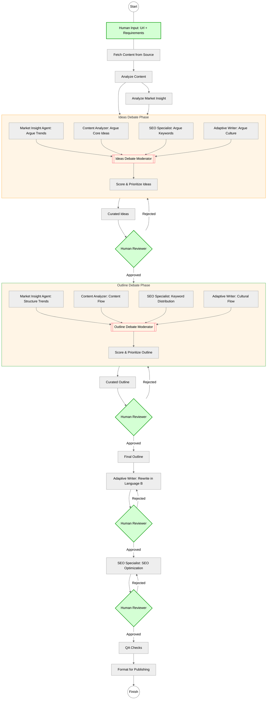

---
last-redoc-date: 2025-11-04
---

# SEW Module - SEO Expert Writer

**Hệ thống AI chuyên nghiệp để viết lại và tối ưu nội dung SEO**

**Phiên bản:** 2.0.0 (Đã hoàn thiện quản lý trạng thái)  
**Trạng thái:** ✅ Production Ready  
**Cập nhật lần cuối:** 2025-11-04

## Mục Lục

- [Tổng Quan](#overview)
  - [Điểm Nổi Bật](#highlights)
  - [Sơ Đồ Quy Trình](#workflow-diagram)
- [Nhật Ký Phiên Bản](#changelog)
- [Cài Đặt Nhanh Cho Người Dùng Cuối](#quick-install)
- Tài Liệu Chi Tiết
  - [Module Overview](docs/overview/module-overview.md)
  - [Operator Quick Start](docs/operators/quick-start.md)
  - [Workflow Lifecycle](docs/operators/workflow-lifecycle.md)
  - [State Management](docs/operators/state-management.md)
  - [Human Approval Playbook](docs/operators/human-approval.md)
  - [Command Reference](docs/operators/command-reference.md)
  - [Agents Catalog](agents/AGENTS-CATALOG.md)
  - [Tasks Snapshot](tasks/README.md)
  - [Developer Workflow Guide](docs/developers/development-workflow.md)
  - [Build Pipeline Reference](docs/developers/build-pipeline.md)
  - [Repository Structure Strategy](docs/developers/repo-structure.md)
  - [Workflow Design Guidelines](docs/developers/workflow-design.md)
  - [Product Requirements](docs/strategy/prd-seo-rewriting-project.md)
  - [Documentation Index](docs/index.md)

---

<a id="overview"></a>
## Tổng Quan

SEW (SEO Expert Writer) là module BMAD chuyên sâu cho việc viết lại và tối ưu nội dung SEO, sử dụng hệ thống multi-agent để tạo ra bài viết chất lượng cao bằng tiếng Việt.

<a id="highlights"></a>
### Điểm Nổi Bật

- ✅ **9 agent chuyên trách** – mỗi agent đảm nhiệm một vai trò rõ ràng trong chuỗi giá trị nội dung.
- ✅ **Multi-agent orchestration** – điều phối đồng bộ giữa nghiên cứu, sáng tạo, viết, tối ưu và QA.
- ✅ **Vietnamese-first** – tập trung cho tiếng Việt, bảo toàn sắc thái văn hoá và giọng điệu bản địa.
- ✅ **SEO-focused** – tối ưu hoá keyword, meta, cấu trúc và liên kết.
- ✅ **Human-in-the-loop** – hai vòng phê duyệt bắt buộc đảm bảo định hướng chiến lược.
- ✅ **Quản lý trạng thái** – có thể dừng, tiếp tục hoặc nhảy bước mà không mất dữ liệu.
- ✅ **Mở rộng linh hoạt** – dễ dàng tuỳ chỉnh agent, workflow, task và tài liệu.

<a id="workflow-diagram"></a>
### Sơ Đồ Quy Trình



---

<a id="quick-install"></a>
## Cài Đặt Nhanh Cho Người Dùng Cuối

1. **Chuẩn bị BMAD Method**
   ```bash
   git clone --branch v6-alpha https://github.com/bmad-code-org/BMAD-METHOD.git bmadv6
   cd bmadv6
   npm install
   ```

2. **Nhận module SEW**
   ```bash
   git clone https://github.com/vantt/bmad-sew-module.git src/modules/sew
   ```

3. **Chạy installer của BMAD**
   ```bash
   npm run bmad:install
   ```

4. **Cấu hình**
   - Chọn module `sew` khi installer yêu cầu.
   - Installer sẽ sao chép từ `src/modules/sew/` sang `bmad/sew/` và tạo `config.yaml`.
   - Xác nhận `output_folder`, `sessions_folder` và các thông số ngôn ngữ.

5. **Hoàn tất & tuỳ chỉnh**
   - Sau khi cài đặt, toàn bộ runtime nằm tại `bmad/sew/`.
   - Khi cập nhật module, sync lại `src/modules/sew/` rồi chạy lại installer hoặc script đồng bộ.

---

<a id="changelog"></a>
## Change Log

### Phiên bản 2.0.0 – Hoàn thiện quản lý trạng thái (2025-11-04)

**Tính năng nổi bật:**
- ✅ Quản lý trạng thái đầy đủ – resume bất kỳ lúc nào.
- ✅ Hệ thống Project ID – tạo slug tiếng Việt, tránh trùng lặp.
- ✅ Content Fetcher 2.0 – lưu snapshot Markdown có metadata.
- ✅ Workflow 9 bước – bao quát toàn bộ quy trình viết lại.
- ✅ Human-in-the-loop – phê duyệt con người ở bước ý tưởng và dàn ý.

**Thành phần:**
- Task lõi: `state-manager`, `generate-project-id`.
- 10 task cập nhật tham số `output_file`.
- Workflow 0-9 lưu trạng thái chi tiết.
- Master orchestrator bổ sung các lệnh quản lý project.
- Tài liệu hoàn thiện, bám sát ReDoc.

**Đầu ra chuẩn:**
- Thư mục `sessions/{project-id}/state.yaml` + backup.
- Chuỗi file `01-raw-content.md` … `09-final-publishable.yaml`.
- Metadata theo dõi tiến độ, lịch sử phê duyệt, khôi phục lỗi.

Xem thêm tại [Quản lý trạng thái](docs/operators/state-management.md) và tài liệu chi tiết trong `docs/operators/state-management.md`.

---