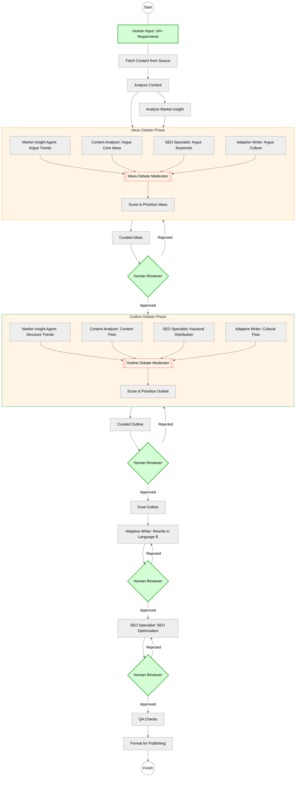
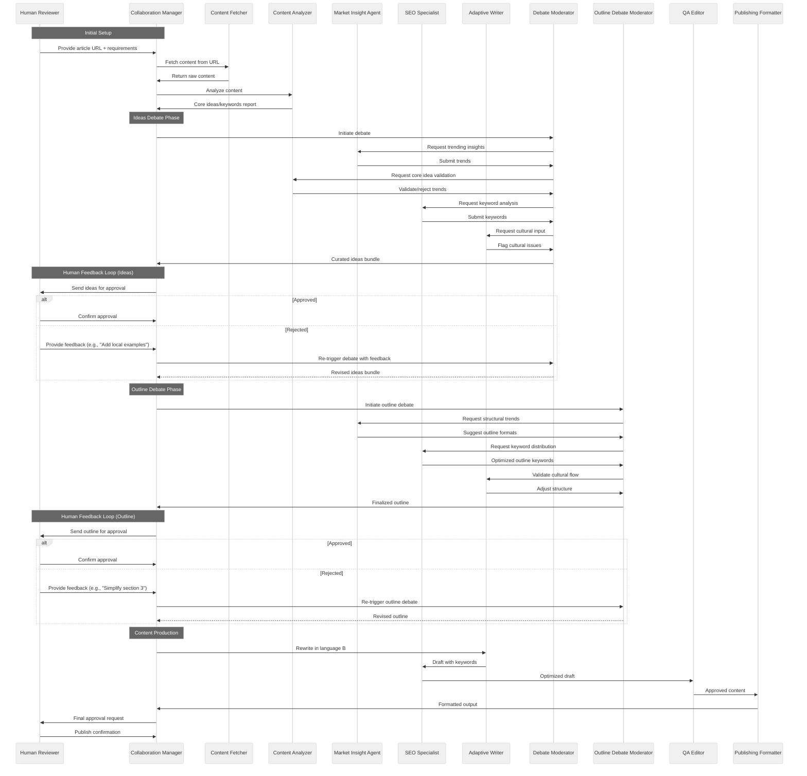

# AI-Human Collaborative SEO Article Rewriting System  

**Next-Gen Content Localization Framework Combining AI Efficiency with Human Strategic Oversight**  
---

**Goal**: Transform an article from language A to a superior version in language B, combining AI efficiency with human oversight.  

## 📋 System Overview  
Transform an article from language A to a superior version in language B, combining AI efficiency with human oversight.
A multi-agent system designed to transform articles between languages while optimizing for:  

## 📋 System Overview  
Transform an article from language A to a superior version in language B, combining AI efficiency with human oversight.
A multi-agent system designed to transform articles between languages while optimizing for:  
- **SEO Performance** (Keyword strategy, metadata, linking)  
- **Cultural Resonance** (Local idioms, examples, narrative flow)  
- **Engagement Potential** (Trend alignment, scroll-depth optimization)  
- **Strategic Alignment** (Core message preservation via debate protocols)  


## **Activity/workflow Diagram**

---

## **Sequence Diagram**

## 🤖 Agents & Roles  

| Agent                     | Core Competency                                                                                      | Key Tools/APIs                      |
| ------------------------- | ---------------------------------------------------------------------------------------------------- | ----------------------------------- |
| **Content Fetcher**       | Extract raw content from the source URL.                                                             | Readability, Scrapy                 |
| **Content Analyzer**      | Semantic deconstruction, Deconstruct the original article into core ideas, keywords, and weaknesses. | spaCy, CoreNLP                      |
| **Market Insight Agent**  | Identify trending topics and gather supplemental data for language B.                                | Google Trends, NewsAPI, Twitter API |
| **SEO Specialist**        | Optimize keywords, metadata, and internal links.                                                     | Ahrefs, SERPAPI, Keyword Clustering |
| **Adaptive Writer**       | Rewrite content into language B with cultural/linguistic adaptation.                                 | DeepL, Cultural Lexicon DB          |
| **Debate Moderator**      | Facilitate AI-to-AI debates to prioritize ideas using scores and arguments.                          | Argument Graph, Weighted Voting     |
| **Collaboration Manager** | Route tasks between agents and humans, resolve technical/logistical issues.                          | Airtable, State Machine             |
| **QA Editor**             | Final grammar, SEO, and accuracy checks.                                                             | Grammarly, Copyscape                |
| **Publishing Formatter**  | Prepare content for platforms (WordPress, PDF, etc.).                                                | WordPress API, PDFGen               |

**Human Role**:  
- **Task Request**: give original article url and additinal requirments.
- **Human Reviewer**: Approve/reject AI-curated ideas post-debate. Add creative or strategic input.  
---

## **Workflow Explanation**  

### 1. **Content Extraction & Analysis**  
- **Content Fetcher** retrieves the original article.  
- **Content Analyzer** identifies core themes, gaps, and keywords.  

### 2. **AI Debate Phase**  
- **Collaboration Manager** triggers the debate by sending a command to the **Debate Moderator**.  
- **Agents Submit Arguments**:  
  - *Market Insight Agent* (`MAD`) argues for trending topics.  
  - *Content Analyzer* (`B_CA`) defends core ideas from the original article.  
  - *SEO Specialist* (`FD`) prioritizes high-value keywords.  
  - *Adaptive Writer* (`ED`) flags cultural/linguistic issues.  
- **Debate Moderator** (`IDM`) consolidates inputs, scores arguments, and curates prioritized ideas.  

> **Note**: Agents inside the debate phase (e.g., `MAD`, `B_CA`) are *visual duplicates* of main agents for diagram clarity but represent the same roles.  

### 3. **Human Review**  
- **Collaboration Manager** sends curated ideas to the **Human Reviewer**.  
  - **Approve**: Proceed to outline drafting.  
  - **Reject**: Collaboration Manager re-triggers the debate phase with feedback (e.g., "Add local case studies").  

### 4. **Outline & Rewriting**  
- **Outline Architect** designs a structure balancing SEO, trends, and culture.  
- **Adaptive Writer** drafts the article in language B.  

### 5. **SEO & Final Checks**  
- **SEO Specialist** optimizes keywords and metadata.  
- **QA Editor** ensures accuracy and readability.  

### 6. **Publishing**  
- **Publishing Formatter** adapts the article for the target platform.  

---

## Example Scenario
- **AI Output**: Debate Moderator proposes "Include 5 trending keywords, but exclude 2 culturally insensitive phrases."  
- **Human Reviewer**: Rejects due to a missing local case study.  
- **Result**: Collaboration Manager reroutes to Debate Phase. Revised ideas include the requested case study.  

---

## Key Features
- **Visual Clarity**: Duplicate agents in the debate phase simplify the diagram while retaining logical consistency.  
- **Centralized Debate Control**: Debate Moderator (`IDM`) acts as the hub for argument consolidation.  
- **Feedback-Driven Iteration**: Human rejections trigger revised debates with minimal manual effort.  

---

## Optional Enhancements
- **Agent Suffixes**: Use labels like `B_CA` (Content Analyzer) to explicitly map duplicates to main roles.  
- **Auto-Scoring Reports**: Debate Moderator generates logs showing how arguments were scored.  

--- 

## 📜 YAML Specification (Crew-AI Compatible)  

```yaml  
name: "SEO_Article_Rewriting_Crew"
description: "AI-human collaborative system for transforming articles between languages with SEO optimization and cultural adaptation"

agents:  
  - name: "Content_Fetcher"
    role: "Web Content Extractor"
    goal: "Retrieve clean raw content from source URLs"
    backstory: "Specializes in bypassing paywalls and extracting main article content while removing ads/boilerplate"
    tools: ["web_scraper", "readability_api"]
    verbose: true

  - name: "Content_Analyzer" 
    role: "Semantic Deconstructor"
    goal: "Identify core concepts, rhetorical patterns, and weaknesses in source content"
    backstory: "Trained in discourse analysis and argumentation mining across multiple languages"
    tools: ["nltk", "spacy", "coreference_resolution"]
    verbose: true

  - name: "Market_Insight_Agent"
    role: "Trend Forecasting Expert"
    goal: "Predict trending topics and cultural relevancy for target audience"
    backstory: "Leverages social listening APIs and search trend data to identify viral opportunities"
    tools: ["google_trends", "buzzsumo", "semrush"]
    verbose: true

  - name: "SEO_Specialist"
    role: "Search Optimization Engine"
    goal: "Maximize organic visibility through keyword strategy and technical SEO"
    backstory: "Combines TF-IDF analysis with competitor gap tracking for ranking optimization"
    tools: ["ahrefs", "surferseo", "keyword_clustering"]
    verbose: true

  - name: "Adaptive_Writer"
    role: "Cross-Cultural Copywriter" 
    goal: "Produce linguistically/culturally adapted content preserving core meaning"
    backstory: "Native speaker with neural translation capabilities and idiom database"
    tools: ["deepL", "cultural_lexicon", "tone_analyzer"]
    verbose: true

  - name: "Debate_Moderator"
    role: "Consensus Builder"
    goal: "Facilitate structured debates between specialist agents"
    backstory: "Expert in conflict resolution and multi-perspective synthesis"
    tools: ["argument_graph", "weighted_voting", "critique_chain"]
    verbose: true

  - name: "Collaboration_Manager"
    role: "Workflow Orchestrator"
    goal: "Coordinate task routing and human-AI handoffs"
    backstory: "Project manager with error handling and priority queuing capabilities"
    tools: ["airtable", "state_machine", "feedback_parser"]
    verbose: true

  - name: "QA_Editor"
    role: "Precision Auditor"
    goal: "Ensure factual accuracy and brand compliance"
    backstory: "Multilingual fact-checker with plagiarism detection skills"
    tools: ["grammarly", "copyscape", "claimbuster"]
    verbose: true

  - name: "Publishing_Formatter"
    role: "Multi-Channel Adapter"
    goal: "Optimize content presentation for target platforms"
    backstory: "CMS expert with responsive design capabilities"
    tools: ["wordpress_api", "pdf_gen", "amp_converter"]
    verbose: true

tasks:  
- name: "Content_Ingestion"
    description: "Fetch and clean source article from provided URL"
    agent: "Content_Fetcher"
    expected_output: "Raw text file with headers/body separated"

  - name: "Semantic_Analysis"
    description: "Extract key arguments, entities, and sentiment patterns"
    agent: "Content_Analyzer"  
    expected_output: "JSON report with concept map and weakness flags"

  - name: "Trend_Mapping"
    description: "Identify trending subtopics and cultural reference opportunities"
    agent: "Market_Insight_Agent"
    expected_output: "Priority-ranked list of 10-15 relevant trends"

  - name: "SEO_Battle_Royale"
    description: "Debate optimal keyword strategy between agents"
    agent: "Debate_Moderator"
    expected_output: "Weighted keyword list with supporting arguments log"
    context:
      - "SEO_Specialist"
      - "Market_Insight_Agent"
      - "Content_Analyzer"

  - name: "Human_Approval_Gate"
    description: "Present recommendations for human review/edits"
    agent: "Collaboration_Manager"
    expected_output: "Signed-off content strategy brief"

  - name: "Adaptive_Drafting"
    description: "Generate culturally adapted first draft"
    agent: "Adaptive_Writer"
    expected_output: "Localized Markdown document with translator notes"

  - name: "Technical_SEO_Pass"  
    description: "Optimize headers, alt text, and internal linking"
    agent: "SEO_Specialist"
    expected_output: "SEO-Enhanced draft with metadata recommendations"

  - name: "Quality_Assurance"
    description: "Final proofreading and compliance check"
    agent: "QA_Editor"
    expected_output: "Clean validated content with audit report"

  - name: "Multi_Format_Publishing"
    description: "Generate platform-specific variants"
    agent: "Publishing_Formatter"
    expected_output: "WordPress XML + PDF + AMP HTML files"
    
  - name: "Market_Insight_Agent"
    role: "Trend Forecasting Expert"
    goal: "Predict trending topics and cultural relevancy for target audience"
    backstory: "Leverages open-source/free-tier APIs and social platforms to identify viral opportunities"
    tools: 
        - "google_trends"  # Free API for search trends
        - "answerthepublic"  # Free visual search query tool (API available)
        - "reddit_api"  # Scrape trending subreddits via PRAW library
        - "newsapi"  # News trends aggregation (free tier available)
        - "twitter_api"  # Track hashtags/trending topics via v2 API
        - "wikidata"  # Cultural/geographic context enrichment
        - "google_scholar"  # Academic/research trend analysis
        - "serpapi"  # Google autocomplete/people-also-ask scraping (free tier)
    verbose: true
    
  - name: "SEO_Battle_Royale"  
    description: "Keyword strategy optimization debate"  
    agent: "Debate_Moderator"  
    context: [SEO_Specialist, Market_Insight_Agent, Content_Analyzer]  

  - name: "Outline_Architect"
    description: "Create initial content structure based on approved strategy"
    agent: "Content_Analyzer"
    expected_output: "Hierarchical outline with section headings and key points"

  - name: "Outline_Debate_Arena"
    description: "Multi-agent debate optimizing content flow and engagement"
    agent: "Debate_Moderator"
    expected_output: "Enhanced outline with debate log and revision marks"
    context:
      - "SEO_Specialist": "Argue for keyword distribution and pillar/cluster structure"
      - "Market_Insight_Agent": "Advocate trending subtopics placement"
      - "Adaptive_Writer": "Flag cultural narrative mismatches"
      - "Content_Analyzer": "Defend core message preservation"

workflow:  
  phases:  
    - analysis: [Content_Ingestion, Semantic_Analysis]  
    - strategy: [Trend_Mapping, SEO_Battle_Royale]  
    - human: [Human_Approval_Gate]  
    - architecture: [Outline_Architect, Outline_Debate_Arena]  
    - production: [Adaptive_Drafting, Technical_SEO_Pass]  
    - validation: [Quality_Assurance, Multi_Format_Publishing]  

  execution_order:
    - "Content_Ingestion"
    - "Semantic_Analysis"
    - "Trend_Mapping"
    - "SEO_Battle_Royale"
    - "Human_Approval_Gate"
    - "Outline_Architect"
    - "Outline_Debate_Arena"
    - "Adaptive_Drafting"
    - "Technical_SEO_Pass"
    - "Quality_Assurance"
    - "Multi_Format_Publishing"

  debate_enhancements:
    outline_evaluation_criteria:
      - "Hook Effectiveness: First 200 character impact score"
      - "Scroll Depth Map: Predicted engagement per section"
      - "Cultural Resonance Index: Local relevance scoring"
      - "SEO Momentum: Keyword distribution gradient"
      - "Conversion Pathway: Call-to-action flow analysis"

  debate_params:  
    max_rounds: 3  
    tiebreaker: "human_in_loop"  

``` 

**To use**: Paste the Mermaid code into a [live editor](https://mermaid.live/) for an interactive diagram.  