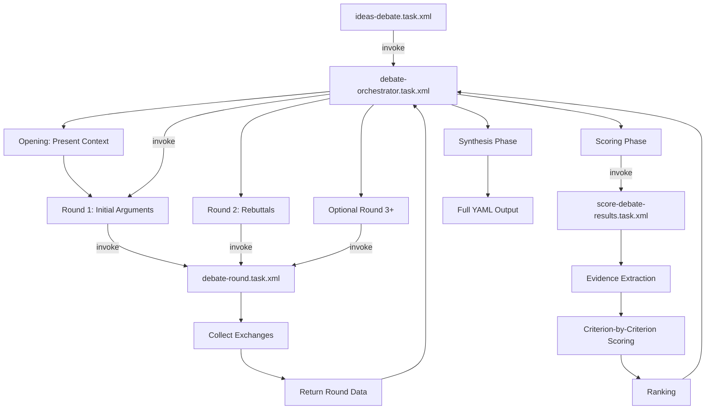

# Debate Infrastructure - Enhanced Multi-Agent Debate System

## Tổng Quan

SEW module đã được nâng cấp với hệ thống debate infrastructure hoàn chỉnh, cho phép **ghi nhận đầy đủ chi tiết từng vòng trao đổi** giữa các agents trong quá trình tranh luận.

## Vấn Đề Trước Đây

**Before (v1.0):**
```yaml
debate_results:
  ranked_ideas: ["idea_1", "idea_2", "idea_3"]
  debate_summary: "Agents discussed and ranked ideas..."
```

❌ **Thiếu sót:**
- Không biết agent nào nói gì
- Không thấy được process tranh luận
- Không trace được tại sao idea này thắng idea kia
- Không có evidence cho scoring
- Không thể review hoặc audit lại

**After (v2.0):**
```yaml
debate_transcript:
  metadata: {...}
  rounds:
    - round_1:
        exchanges:
          - agent: "ContentAnalyzer"
            argument: "Full text of their complete argument..."
            key_points: [...]
          - agent: "MarketInsightAgent"
            argument: "Their full perspective..."
    - round_2:
        exchanges:
          - agent: "ContentAnalyzer"
            responds_to: ["MarketInsightAgent"]
            rebuttal: "I agree with market fit, but..."
  scoring:
    - idea: "idea_1"
      criterion: "SEO Performance"
      score: 8.5
      rationale: "Based on SEOSpecialist Round 1..."
      supporting_evidence: [...]
```

✅ **Lợi ích:**
- Full transcript của mọi exchange
- Agent attribution rõ ràng
- Cross-references giữa agents
- Evidence-based scoring
- Auditable và analyzable

## Kiến Trúc Mới

### Core Components

```
bmad/sew/tasks/
├── debate-orchestrator.task.xml     [CORE ENGINE]
│   ├─> Điều phối toàn bộ debate process
│   ├─> Quản lý rounds
│   ├─> Invoke debate-round và scoring tasks
│   └─> Output full YAML transcript
│
├── debate-round.task.xml            [ROUND EXECUTOR]
│   ├─> Thực thi 1 round cụ thể
│   ├─> Collect arguments/rebuttals từ agents
│   ├─> Capture cross-references
│   └─> Return round data với exchanges[]
│
├── score-debate-results.task.xml    [SCORING ENGINE]
│   ├─> Extract evidence từ transcript
│   ├─> Score theo criteria
│   ├─> Reference agent arguments
│   └─> Rank ideas với rationale
│
├── ideas-debate.task.xml            [WRAPPER]
│   └─> Invoke orchestrator cho ideas debate
│
└── outline-debate.task.xml          [WRAPPER]
    └─> Invoke orchestrator cho outline debate
```

### Agents

```
bmad/sew/agents/
└── debate-moderator.agent.yaml
    ├─ *run-debate → exec: debate-orchestrator.task.xml
    └─ *debate-manual → Instructions for advanced usage
```

## Debate Flow



## Output Structure - YAML Format

### Top Level

```yaml
metadata:
  topic: "Prioritize ideas for article rewrite"
  debaters: ["ContentAnalyzer", "MarketInsightAgent", "SEOSpecialist", "AdaptiveWriter"]
  scoring_criteria: ["SEO Performance", "Cultural Resonance", "Engagement Potential", "Strategic Alignment"]
  timestamp: "2025-11-05T18:00:00Z"
  total_rounds: 2

opening:
  moderator_introduction: |
    Welcome to Ideas Debate...
  ideas_presented:
    - id: "idea_1"
      title: "Comprehensive guide to healthy aging"
      description: "..."
  context_summary: "Key insights from market research..."

rounds: [...]   # Detailed below
scoring: [...]  # Detailed below
final_ranking: [...]
synthesis: {...}
```

### Round Structure

```yaml
rounds:
  - round_number: 1
    round_type: "initial_arguments"
    timestamp: "2025-11-05T18:05:00Z"
    exchanges:
      - agent: "ContentAnalyzer"
        agent_role: "Content depth and quality expert"
        argument: |
          Looking at idea_1, I see strong potential for comprehensive coverage.
          The topic allows for deep analysis of multiple aspects...
          [Full argument text preserved]
        key_points:
          - "Comprehensive coverage opportunity"
          - "Multiple expert sources available"
          - "Strong narrative potential"
        ideas_assessment:
          - idea_id: "idea_1"
            stance: "strongly_support"
            reason: "Best balance of depth and accessibility"
          - idea_id: "idea_2"
            stance: "support"
            reason: "Good topic but narrower scope"

      - agent: "MarketInsightAgent"
        argument: |
          From market perspective, idea_1 aligns perfectly with current trends...
        key_points: [...]
        ideas_assessment: [...]

      - agent: "SEOSpecialist"
        argument: |
          SEO analysis shows idea_1 has strongest keyword opportunities...
        key_points: [...]

      - agent: "AdaptiveWriter"
        argument: |
          Culturally, idea_1 resonates well with Vietnamese health consciousness...
        key_points: [...]

    round_dynamics:
      consensus_areas:
        - "All agents see value in comprehensive approach"
      disagreements:
        - topic: "Timeline feasibility"
          positions:
            - agent: "ContentAnalyzer"
              position: "Needs 2-3 weeks for research"
            - agent: "MarketInsightAgent"
              position: "Should publish within 1 week for trend"
      emerging_themes:
        - "Quality vs speed tradeoff recurring"

  - round_number: 2
    round_type: "rebuttals_and_builds"
    exchanges:
      - agent: "ContentAnalyzer"
        responds_to:
          - agent: "MarketInsightAgent"
            point: "Timeline concern about 2-3 weeks"
            response_type: "clarification"
            response: |
              I understand the urgency, but we can do phased publishing:
              - Week 1: Core article with basics
              - Week 2-3: Deep-dive sections added
        builds_on:
          - agent: "SEOSpecialist"
            builds_on: "Keyword clustering strategy"
        refined_position: |
          Revised recommendation: Start with MVP article, expand incrementally
        key_points:
          - "Phased publishing reduces time pressure"
          - "Maintains quality while being responsive"

      - agent: "MarketInsightAgent"
        responds_to: [...]
        challenges:
          - agent: "AdaptiveWriter"
            challenge: "Cultural fit concern for idea_3"
        # ... more exchanges
```

### Scoring Structure

```yaml
scoring:
  - idea_id: "idea_1"
    idea_title: "Comprehensive guide to healthy aging"
    criterion: "SEO Performance"
    score: 8.5
    max_score: 10.0
    rationale: |
      Strong score based on following evidence:
      - SEOSpecialist (Round 1) identified high search volume keywords
      - MarketInsightAgent (Round 2) confirmed trending topic
      - Minor concern about keyword density addressed in Round 2
    supporting_evidence:
      - agent: "SEOSpecialist"
        round: 1
        quote: "Monthly search volume 50K+ for primary keyword"
      - agent: "MarketInsightAgent"
        round: 2
        quote: "Topic trending +30% in last 3 months"
    concerns_addressed:
      - concern: "Keyword stuffing risk"
        raised_by: "ContentAnalyzer"
        addressed_by: "SEOSpecialist"
        resolution: "Use LSI keywords and natural placement"
    agent_consensus: "high"

  - idea_id: "idea_1"
    criterion: "Cultural Resonance"
    score: 9.0
    rationale: |
      Excellent cultural fit:
      - AdaptiveWriter (Round 1) highlighted strong alignment with Vietnamese values
      - All agents agreed on cultural appropriateness
    supporting_evidence: [...]
    agent_consensus: "unanimous"

  # ... scores for all criteria for idea_1

  - idea_id: "idea_2"
    criterion: "SEO Performance"
    score: 7.0
    # ... similar structure
```

### Final Ranking

```yaml
final_ranking:
  - rank: 1
    idea_id: "idea_1"
    idea_title: "Comprehensive guide to healthy aging"
    scores_by_criterion:
      seo_performance: 8.5
      cultural_resonance: 9.0
      engagement_potential: 7.5
      strategic_alignment: 8.0
    total_score: 33.0
    average_score: 8.25
    max_possible: 40.0
    percentage: 82.5%
    consensus_level: "high"
    support_count: 4
    oppose_count: 0
    neutral_count: 0
    key_strengths:
      - "Strong SEO potential (SEOSpecialist, MarketInsightAgent)"
      - "Excellent cultural fit (AdaptiveWriter)"
      - "Comprehensive approach valued (ContentAnalyzer)"
    key_concerns:
      - "Timeline might be tight (addressed via phased publishing)"
    overall_assessment: |
      Clear winner with strong consensus across all agents.
      Best balance of SEO performance, cultural resonance, and strategic fit.

  - rank: 2
    idea_id: "idea_2"
    # ... similar structure

  - rank: 3
    idea_id: "idea_3"
    # ...
```

### Synthesis

```yaml
synthesis:
  key_insights:
    - "All agents prioritize quality over speed, but recognize market timing importance"
    - "Cultural resonance is non-negotiable - must align with Vietnamese values"
    - "SEO and engagement can be balanced with smart keyword strategy"
  controversial_points:
    - point: "Publishing timeline"
      debaters_for: ["MarketInsightAgent"]
      debaters_against: ["ContentAnalyzer"]
      resolution: "Phased publishing compromise accepted by all"
  unanimous_support:
    - idea: "idea_1"
      reason: "All agents rated it top or second choice"
  split_decisions:
    - idea: "idea_3"
      split_reason: "Strong SEO but weaker cultural fit created division"
  surprising_revelations:
    - "ContentAnalyzer's phased publishing suggestion resolved timeline conflict"
    - "SEOSpecialist's LSI keyword strategy addressed quality concerns"
```

## Usage Examples

### Example 1: Ideas Debate

```xml
<invoke-task
  exec="{project-root}/bmad/sew/tasks/ideas-debate.task.xml"
  parameters:
    topic: "Prioritize article ideas"
    ideas_list: [
      {id: "idea_1", title: "Guide to healthy aging", description: "..."},
      {id: "idea_2", title: "Senior fitness tips", description: "..."}
    ]
    content_analysis_report: "..."
    market_insight_report: "..."
    num_rounds: 2
    output_file: "{sessions_folder}/ideas-debate-transcript.yaml"
  output_variable: "debate_results"
/>
```

### Example 2: Outline Debate

```xml
<invoke-task
  exec="{project-root}/bmad/sew/tasks/outline-debate.task.xml"
  parameters:
    topic: "Choose article structure"
    approved_ideas: "..."
    outline_options: [
      {id: "outline_a", title: "Problem-Solution structure", sections: [...]},
      {id: "outline_b", title: "Chronological approach", sections: [...]}
    ]
    num_rounds: 3
    output_file: "{sessions_folder}/outline-debate-transcript.yaml"
  output_variable: "debate_results"
/>
```

### Example 3: Direct Orchestrator Call

```xml
<invoke-task
  exec="{project-root}/bmad/sew/tasks/debate-orchestrator.task.xml"
  parameters:
    topic: "Custom debate topic"
    debaters: ["Agent1", "Agent2", "Agent3"]
    scoring_criteria: ["Criterion1", "Criterion2"]
    context_data: "..."
    ideas_to_debate: [...]
    num_rounds: 4  # More thorough debate
    output_file: "path/to/transcript.yaml"
  output_variable: "results"
/>
```

## Configuration

### Flexible Rounds

```yaml
num_rounds: 2  # Quick debate (initial + rebuttal)
num_rounds: 3  # Standard (initial + rebuttal + refinement)
num_rounds: 4  # Deep dive (+ additional refinement round)
```

### Custom Criteria

Ideas debate criteria:
- SEO Performance
- Cultural Resonance
- Engagement Potential
- Strategic Alignment

Outline debate criteria:
- Logical Flow
- SEO Keyword Distribution
- Cultural Flow
- Hook Effectiveness
- Readability

Custom criteria cho specific debates.

## Benefits

### 1. Transparency
- Mọi exchange được ghi nhận
- Agent reasoning rõ ràng
- Scoring có evidence backing

### 2. Auditability
- Review lại toàn bộ debate
- Understand why decisions made
- Identify potential biases

### 3. Learning
- See how agents think
- Learn argumentation patterns
- Improve criteria over time

### 4. Quality Assurance
- Human reviewers có full context
- Can challenge scoring if needed
- Evidence-based decisions

### 5. Reproducibility
- Full transcript = reproducible
- Can replay logic
- Debug issues easier

## Best Practices

### 1. Provide Rich Context
```yaml
context_data: |
  === Source Analysis ===
  Key findings: ...

  === Market Research ===
  Trends: ...

  === User Feedback ===
  Common requests: ...
```

### 2. Clear Ideas/Options
```yaml
ideas_to_debate:
  - id: "idea_1"
    title: "Clear, descriptive title"
    description: "Detailed description with key points"
    rationale: "Why this idea was generated"
```

### 3. Meaningful Criteria
- Choose criteria relevant to decision
- Define what each criterion means
- Ensure criteria are measurable

### 4. Appropriate Rounds
- 2 rounds: Quick decisions, clear options
- 3 rounds: Standard debates, moderate complexity
- 4+ rounds: Complex decisions, need deep exploration

### 5. Review Transcripts
- Don't just trust rankings
- Read key exchanges
- Look for insights in synthesis
- Check evidence for top scores

## Troubleshooting

### Debate too long?
- Reduce num_rounds to 2
- Use more focused criteria
- Provide clearer context

### Agents agreeing too easily?
- Add more diverse criteria
- Include challenging aspects
- Review agent personas

### Scoring seems off?
- Check supporting_evidence
- Read agent arguments
- Verify criteria alignment

### Missing cross-references?
- Ensure Round 2+ are rebuttals_and_builds
- Check agents are responding to each other
- May need more explicit prompting

## Migration from Old System

Old wrapper tasks invoke non-existent core agents:
```xml
<!-- OLD - Don't use -->
<invoke-task exec="bmad/core/tasks/invoke-agent.xml"
  agent_id="bmad/core/agents/facilitator"  <!-- Doesn't exist -->
```

New infrastructure self-contained in SEW:
```xml
<!-- NEW - Use this -->
<invoke-task exec="{project-root}/bmad/sew/tasks/debate-orchestrator.task.xml"
  parameters: {...}
```

## Future Enhancements

Potential additions:
- [ ] Debate visualization tools
- [ ] Agent performance analytics
- [ ] Automated insight extraction
- [ ] Debate replay/review UI
- [ ] Comparative debate analysis
- [ ] Custom agent selection per round

## Related Documentation

- `bmad/sew/agents/debate-moderator.agent.yaml` - Moderator agent definition
- `bmad/sew/tasks/README.md` - Task overview
- `bmad/sew/docs/operators/workflow-lifecycle.md` - How debates fit in workflow

---

**Maintained by:** SEW Module Team
**Last Updated:** 2025-11-05
**Version:** 2.0 (Debate Infrastructure)
